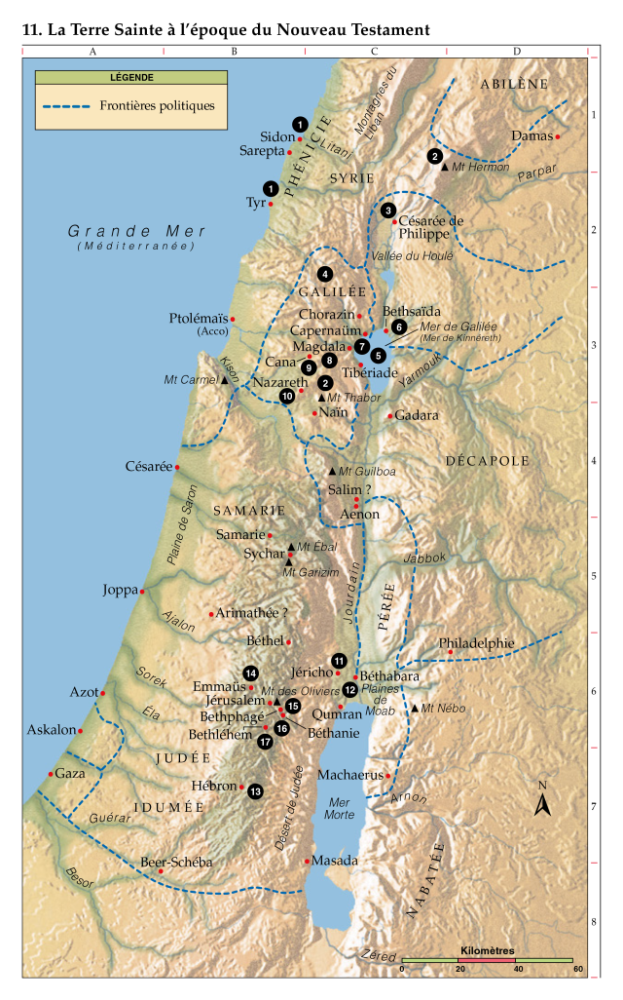

## Bienvenue

Ce site est un travail de recherche personnelle en évolution.

Son but sans prétention est de présenter les textes de l'Évangile chrétien sous forme [harmonisée](https://fr.wikipedia.org/wiki/Harmonie_des_%C3%89vangiles), chronologique, datée et annotée comme je souhaitais pouvoir les lire.

Les quatre évangiles canoniques [Marc](/annexes/marc), [Luc](/annexes/luc), [Matthieu](/annexes/matthieu) et [Jean](/annexes/jean) sont utilisés.
Quelques autre textes en plus des évangiles sont aussi inclus (ex: Acte des apôtres).

## Traduction

La traduction choisie est la [TOB 2010](https://fr.wikipedia.org/wiki/Traduction_%C5%93cum%C3%A9nique_de_la_Bible). La TOB est une traduction œcuménique qui a été réalisée par des représentants de différentes confessions chrétiennes: catholiques, protestantes, et orthodoxes. Elle vise à fournir une traduction accessible pour un usage général tout en conservant la profondeur et le contexte des textes. Elle se base sur les meilleurs manuscrits disponibles, en tenant compte des dernières découvertes et recherches. Elle est considérée comme fidèle aux textes originaux, bien qu'elle adopte parfois une approche plus dynamique ou paraphrastique pour rendre le sens du texte dans un français fluide.

## Mise en garde

La datation et les cartes n'ont pas ici pour but de dessiner un _Jésus historique_ mais d'inscrire l'Évangile dans une temporalité et des lieux existants ou ayant existés.

Une attention a été portée sur les droits d'utilisations. Néanmoins. en cas de problème sur ces droits d'utilisation d'images, de textes ou autres merci de me contacter.

## Sources et références


